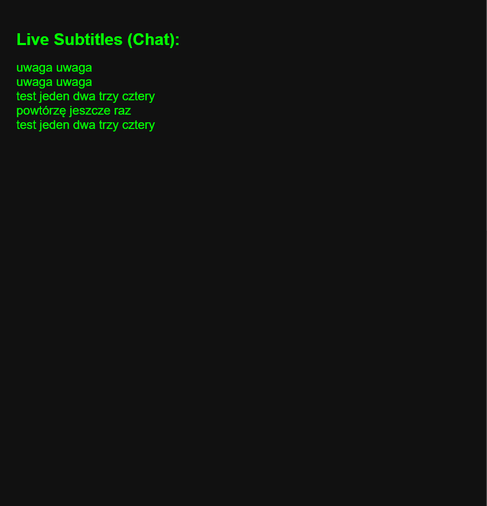

# vosk-websocket-transcriber

Real-time speech-to-text transcription from microphone audio using Vosk, streamed live over WebSocket.

### Requirements
 - RPi zero 2 W
 - correctly connected respeaker

### Installation

```
python3 -m venv venv
source venv/bin/activate
pip3 install vosk websockets sounddevice
wget https://alphacephei.com/vosk/models/vosk-model-small-pl-0.22.zip
unzip vosk-model-small-pl-0.22.zip
```

### Usage
```
//start http server

python3 -m http.server 8000

//in other terminal run backend server

source venv/vin/activate
python3 server.py
```

 - change index.html to match your server/RPi IP
 - Vosk’s lightweight Polish model can be swapped
 - to recognize speech well, the room must be quiet and you should speak clearly


